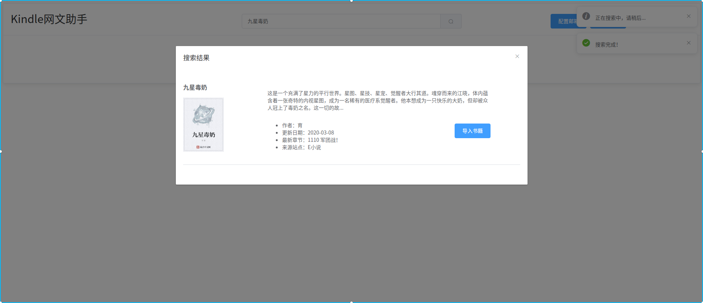
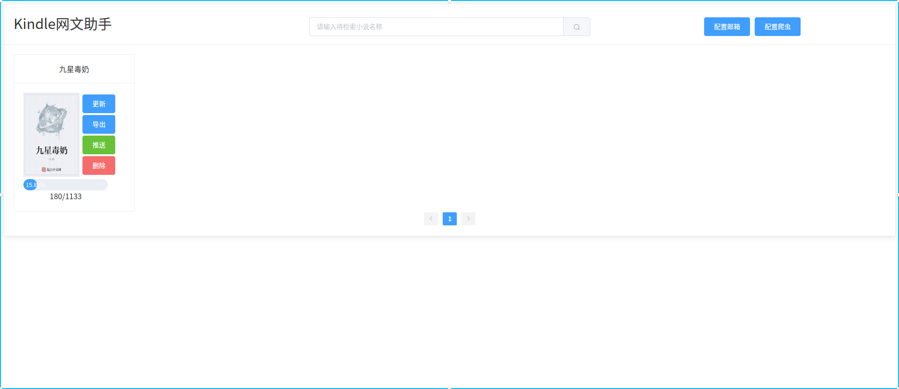
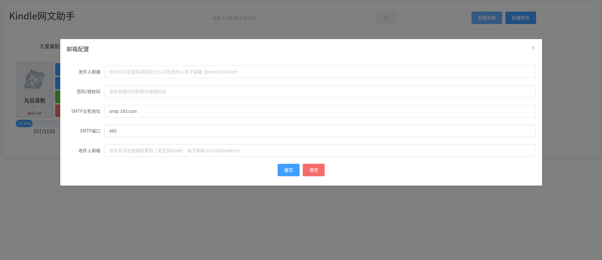
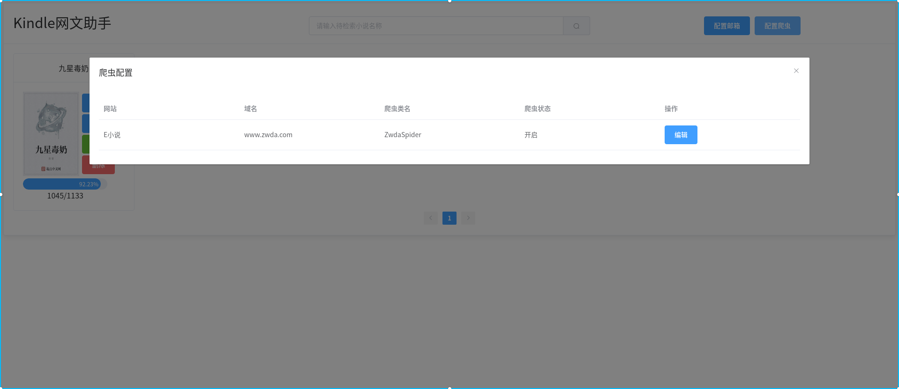
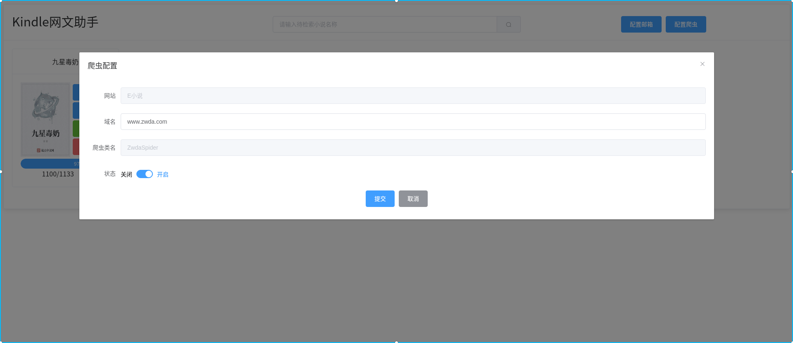
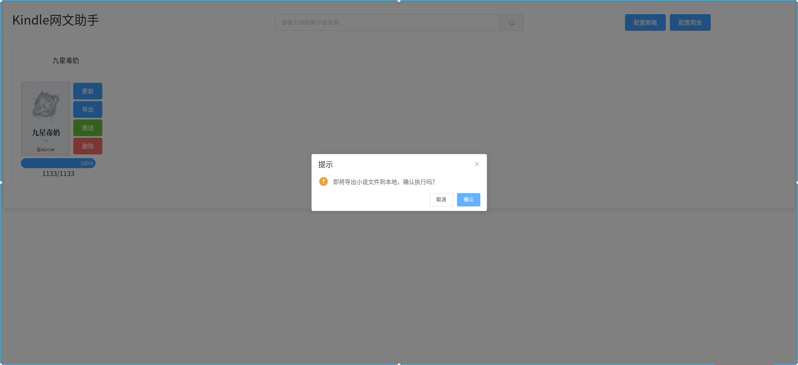
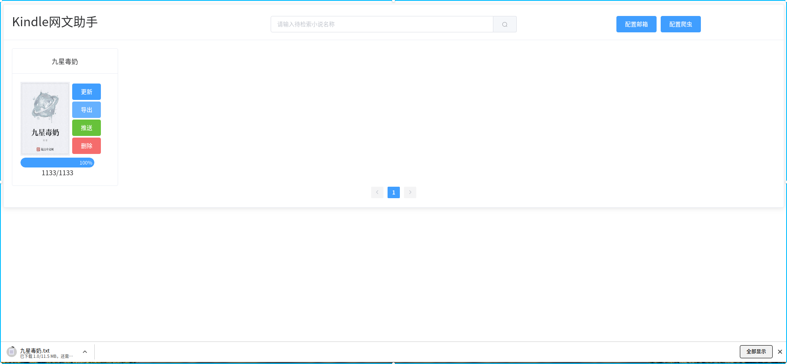
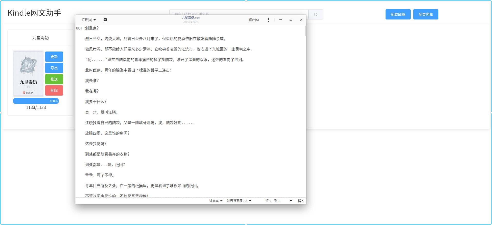
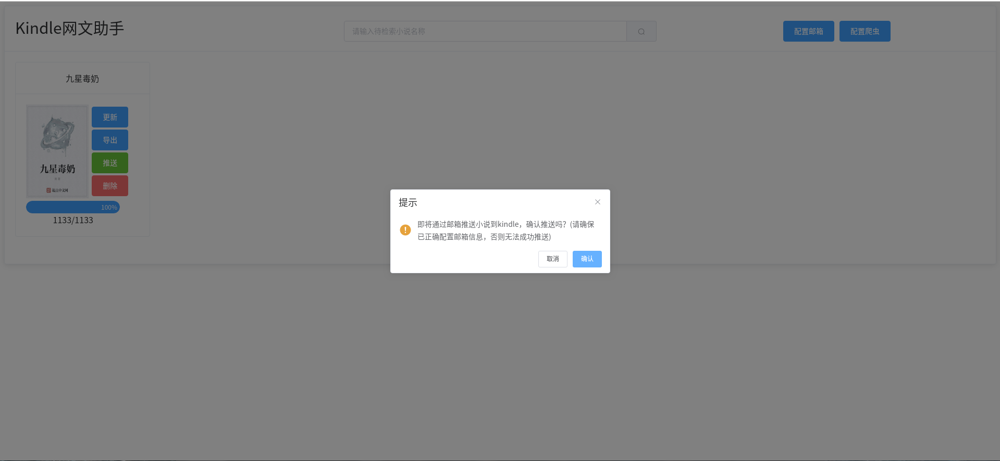

# Kindle网文助手

Kindle网文助手，支持从网络上下载网络小说，并推送到kindle上阅读。是为解决无法在kindle上方便阅读网文而编写的小项目。

请注意，此项目不提倡盗版阅读，只因为手机起点看书费眼，也没有推送到kindle的途径，才萌生想法编写此项目。没有直接爬起点网站，是嫌起点反爬太多，太麻烦了（毕竟起点要面对那么多盗版网站的爬虫）。网文作者写书不易，有能力的朋友尽量订阅支持一下。

**推荐如下操作：** 选择一本想看的书xxx => 打开起点，找到xxx => 自动订阅 => 打开kindle网文助手，缓存xxx => 推送到kindle阅读

如果真的没有闲钱，也请注册一下起点的账号，加一下收藏，投一下免费的推荐票，为你喜欢的小说点赞。写手不易，且行且珍惜。

花了几天零碎时间写的第一个极简版本，比较简陋，等待后期迭代。

**此项目只用于技术交流，请勿用于任何商业用途，否则后果自负！**

# 开发环境

- 后端　Python3 + Flask
- 前端　Vue.js + Element UI
- 数据库　MySQL
- 消息队列　RabbitMQ


# 启动项目

1.下载项目：

```git clone xxx```

2.切换到项目根目录下的src目录：

```cd WebFictionForKindle/src```

3.安装依赖环境：

当pip对应于python3时(比如使用anaconda安装的python环境)：

```pip install -r requirements.txt```

当pip3对应于python3时：

```pip3 install -r requirements.txt```

4.修改`config.py`里的数据库参数和消息队列参数，与你的数据库和消息队列参数一致。

如果没有安装mysql和rabbitmq，可以通过docker安装，请参考：

https://hub.daocloud.io/repos/fa51c1d6-9dc2-49d9-91ac-4bbfc24a1bda

https://hub.daocloud.io/repos/abd7d091-dc5e-4f20-8267-d17d845c1c36

mysql请安装5.7版本。

5.使用数据库可视化软件(DBeaver,Navicat,Mysql Workbench等)连接数据库，创建名为`kindle_web_fiction`的数据库，字符集选择utf8mb4。

6.根据需求修改`gunicorn_config.py`中的配置（无特殊需求可以不修改）。

7.启动web服务：

```bash run_web.sh```

如果需要后台运行，可以使用screen或者nohup。这里举个使用screen后台运行web服务的例子：

首先，你需要安装screen，以debian为例：

```sudo apt-get install screen```

先创建一个screen：

```screen -S kindle_web```

`kindle_web`就是我们创建的这个screen的标识。

运行启动脚本:

```bash run_web.sh```

断开screen链接，让程序后台运行，输入快捷键`Ctrl+A+D`。

当需要重新连接到程序时，不需要重新创建screen，直接输入如下命令即可：

```screen -r kindle_web```

需要后台运行时，同样输入快捷键`Ctrl+A+D`即可。

8.启动爬虫服务：

```python3 run_spider.py```

后台运行的方法参考第7步，当然，你需要给新创建的screen一个新的标识，比如`kindle_spider`。

完成，接下来直接在web中访问主机名+端口号即可，默认[http://localhost:7777/](http://localhost:7777/),根据个人情况修改。

# TODO List

- 增加更多的爬虫，支持更多的网站
- 规范和优化

# 自定义说明

如果想要自行增加更多的爬虫支持，只需要在`src/spiders/spider.py`中添加相关的爬虫类，继承`BaseSpider`类并实现相关接口即可。程序会自动识别所有爬虫。

# 项目演示

1.打开浏览器，访问主页，默认[http://localhost:7777/](http://localhost:7777/),根据个人情况修改：


2.当前没有缓存任何小说，我们搜索一下：



3.只搜索出来一个结果。看一下基本信息，这就是我需要的，所以我点击`导入书籍`。可以看到，书籍被加入到书架中，并开始缓存所有章节：


4.小说的缓存进度会自动刷新，每5秒刷新一次：



5.在小说缓存的过程中，我们看一下其他功能。如果需要推送小说到kindle，还需要配置邮箱信息。点击`配置邮箱`按钮：



按照要求填写各配置项，并提交。关于亚马逊的〖发送至Kindle〗的更多信息，可以参考[了解如何使用〖发送至Kindle〗电子邮箱](https://www.amazon.cn/gp/help/customer/display.html/ref=hp_left_v4_sib?ie=UTF8&nodeId=G7NECT4B4ZWHQ8WV)系列文档。

6.`配置爬虫`按钮可以对使用的爬虫进行管理，初始版本只加入了一个爬虫，后面会加入更多爬虫：





7.小说已经缓存完成了，点击`更新`按钮，会检测小说是否有新增章节，并自动缓存新增章节。


8.`导出`按钮，可以导出小说的txt文件到本地：





我把服务跑在一个远程小主机上了，配置很差，带宽只有1m，所以下载到本地有点慢。



9.更多时候，我们并不需要把txt导出到本地。点击`推送`按钮，可以直接远程生成txt文件并推送到kindle上：



请注意，亚马逊的文档推送服务有一定的延迟，打开kindle的网络连接，耐心等待一下，就能在kindle上看到这本小说。

大概就是这样吧，`删除`就不用演示了。

# 前端项目

[AaronJny/web_fiction_for_kindle_front](https://github.com/AaronJny/web_fiction_for_kindle_front)

